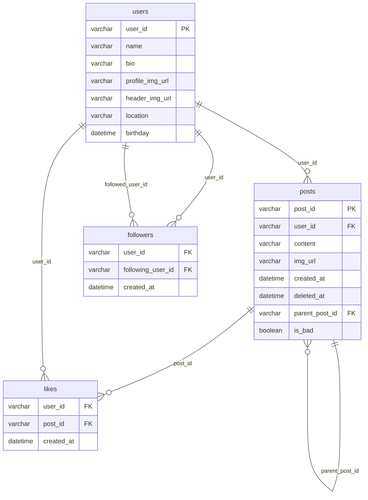

# UTTC_hackathon_back
ハッカソン用のバックエンドリポジトリ

controller, dao, usecaseはエンドポイントごとにコードを分割。

dao/init_dao.goでdaoアクセス管理やローカルとGCPの環境変数切り替え。

# DB

### `users` テーブル

- **user_id** `PK`: ユーザーごとに一意のID。ユーザーを一意に識別。
- **name**: ユーザーの名前。
- **bio**: ユーザーの自己紹介やプロフィールの説明。
- **profile_img_url**: プロフィール画像のURL。
- **header_img_url**: ヘッダ画像のURL。
- **location**: 位置。
- **birthday**: 誕生日。

---

### `posts` テーブル

- **post_id** `PK`: 各投稿に割り当てられた一意のID。
- **user_id** `FK`: 投稿を作成したユーザーのID。`user` テーブルの `user_id` と紐づく。
- **content**: 投稿の内容。
- **created_at**: 投稿が作成された日時。
- **deleted_at**: 投稿が削除された日時。論理削除するために使用。
- **parent_post_id** `FK`: リプライなどの場合、親投稿のID。`post` テーブルの `post_id` と紐づく。
- **is_bad**: その投稿が良識に反しているとtrueになる。

---

### `likes` テーブル

- **user_id** `FK`: いいねをしたユーザーのID。`user` テーブルの `user_id` と紐づく。
- **post_id** `FK`: いいねされた投稿のID。`post` テーブルの `post_id` と紐づく。
- **created_at**: いいねをした日時。

---

### `followers` テーブル

- **user_id** `FK`: フォローしているユーザーのID。`user` テーブルの `user_id` と紐づく。
- **following_user_id** `FK`: フォローされているユーザーのID。`user` テーブルの `user_id` と紐づく。
- **created_at**: フォローした日時。

---

# バックエンド_エンドポイント設計

### **1. ユーザー認証関連エンドポイント**

| エンドポイント | メソッド | 説明 | 必要なJSONコンテンツ |
| --- | --- | --- | --- |
| `/auth/register` | POST | 新規ユーザー登録 | `user_id`, `name`, `bio`, `profile_img_url` |

---

### **2. ユーザー管理エンドポイント**

| エンドポイント | メソッド | 説明 | 必要なJSONコンテンツ |
| --- | --- | --- | --- |
| `/user/{user_id}` | GET | ユーザーの詳細情報を取得 | - |
| `/user/update-profile` | PUT | プロフィール情報の更新 | `user_id`, `name`, `bio`, `profile_img_url` |
| `/users/top/tweets` | GET | ツイート数が多い順にユーザーを取得（オプション: `limit` デフォルト: 100） | - |
| `/users/top/likes` | GET | もらったいいね数が多い順にユーザーを取得（オプション: `limit` デフォルト: 100） | - |

---

### **3. ツイート関連エンドポイント**

| エンドポイント | メソッド | 説明 | 必要なJSONコンテンツ |
| --- | --- | --- | --- |
| `/post/create` | POST | 新しい投稿を作成 | `user_id`, `content`, `img_url` |
| `/post/{post_id}` | GET | 投稿の詳細を取得 | - |
| `/post/{post_id}/update` | PUT | 投稿の内容を更新 | `user_id`, `content`, `img_url` |
| `/post/{post_id}/delete` | DELETE | 投稿を削除 | `user_id` |
| `/post/{post_id}/reply` | POST | 指定した投稿にリプライ | `user_id`, `content`, `img_url`  |
| `/post/{post_id}/children` | GET | 投稿への返信一覧を取得 | - |
| `/post/{post_id}/check_deleted` | GET | 投稿が削除されているかを取得 | - |

---

### **4. いいね関連エンドポイント**

| エンドポイント | メソッド | 説明 | 必要なJSONコンテンツ |
| --- | --- | --- | --- |
| `/like/{post_id}` | POST | 投稿にいいねを追加 | `user_id` |
| `/like/{post_id}/remove` | DELETE | 投稿のいいねを削除 | `user_id` |
| `/like/{post_id}/users` | GET | 指定投稿にいいねしたユーザー一覧を取得 | - |

---

### **5. フォロー関連エンドポイント**

| エンドポイント | メソッド | 説明 | 必要なJSONコンテンツ |
| --- | --- | --- | --- |
| `/follow/{user_id}` | POST | 指定ユーザーをフォロー | `user_id` |
| `/follow/{user_id}/remove` | DELETE | 指定ユーザーのフォローを解除 | `user_id` |
| `/follow/{user_id}/followers` | GET | 指定ユーザーのフォロワー取得 | - |
| `/follow/{user_id}/following` | GET | 指定ユーザーのフォロー中取得 | - |
| `/follow/graph` | GET | フォローグラフを取得 | - |

---

### **6. タイムラインエンドポイント**

| エンドポイント | メソッド | 説明 | 必要なJSONコンテンツ |
| --- | --- | --- | --- |
| `/timeline/{auth_id}` | GET | ログインユーザーのタイムライン | - |
| `/timeline/posts_by/{user_id}` | GET | 指定ユーザーの投稿一覧を取得 | - |
| `/timeline/liked_by/{user_id}` | GET | 指定ユーザーがいいねした投稿一覧を取得 | - |

### **7.  検索関連エンドポイント**

| エンドポイント | メソッド | 説明 | 必要なJSONコンテンツ |
| --- | --- | --- | --- |
| `/find/user/{key}` | GET | 指定したキーワードを `name` または `bio` に含むユーザーを検索 | - |
| `/find/post/{key}` | GET | 指定したキーワードを `content` に含む投稿を検索 | - |

### **8. Gemini関連エンドポイント**

| エンドポイント | メソッド | 説明 | 必要なJSONコンテンツ |
| --- | --- | --- | --- |
| `/gemini/generate_name/{auth_id}` | POST | 指定したユーザーの過去ツイートをもとに、`instruction`に従った名前を生成。`instruction`が””なら何も指示しない | `instruction` |
| `/gemini/generate_bio/{auth_id}` | POST | 指定したユーザーの過去ツイートをもとに、`instruction`に従った自己紹介を生成。`instruction`が””なら何も指示しない | `instruction` |
| `/gemini/generate_tweet_continuation/{auth_id}` | POST | 指定したユーザーの過去ツイートをもとに、`instruction`に従って`temp_text`に続くツイートを生成。`instruction`が””なら何も指示しない |  `instruction`, `temp_text` |
| `/gemini/check_isbad/{post_id}` | GET | 指定したツイートのコンテンツを見て、良識に反する内容なら"YES"、そうでないなら"NO"を返す | - |
| `/gemini/update_isbad/{post_id}/{bool}`  | PUT | 指定したツイートのis_badカラムを`bool` が0ならfalse, 1ならtrueに変更する | - |
| `/gemini/recommend/{auth_id}` | POST | 指定したユーザがまだフォローしていないユーザの中から、`instruction` に従っておすすめのユーザのidを返す | `instruction` |
